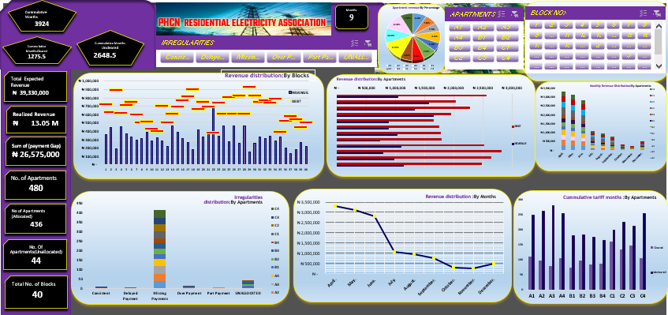

# ABOUT ME

Hello! I'm Ubani blessing, a detail driven data analyst, I empower organizations to make informed decision by transforming complex data into actionable insight. With Excel, Power BI and SQL, I leverage advanced data analysis and visualization techniques to uncover trends, Identify areas of improvement and drive business growth.

# SKILLS

1. Proficient in data cleaning, processing and exploratory data analysis (EDA) using Excel and Power BI
2. Experience building interactive dashboards and reports using Excel and Power BI
3. Excellent communication and data storytelling skills and ability to translate complex data insights into actionable recommendations.

# My Projects

Below are some of the projects I have worked on.

## PHCN Electricity Distribution Tariff

	 <!-- Image of Project Dashboard -->	

The PHCN popularly known as NEPA is a Nigerian owned Electricity distrbution company saddled  with the responsibility of Electricity distribution. it is the countries most prominent national grid for now, however so many economic factors has plagued its existence, leading to its loss of revenue generation and financial planing. This project seeks to analyze factors that influence survival of the company,its irregularities.
[Read More](PHCN_documentation.pdf)

# Contact Me

|----------|----------|
| 📩   |   [ubaniblessed.1@gmail.com](mailto:ubaniblessed.1@gmail.com)  	 
| 📞   |   [2347050627116](https://wa.me/2347050627116)  	  	 		
| 🗃️	| 	[View Resume](resume.pdf)				 			
| 📺	|	[ubaniblesssing/URL](https://www.example.com)	          		 | 		<!-- replace https://www.example.com with your youtube url -->

